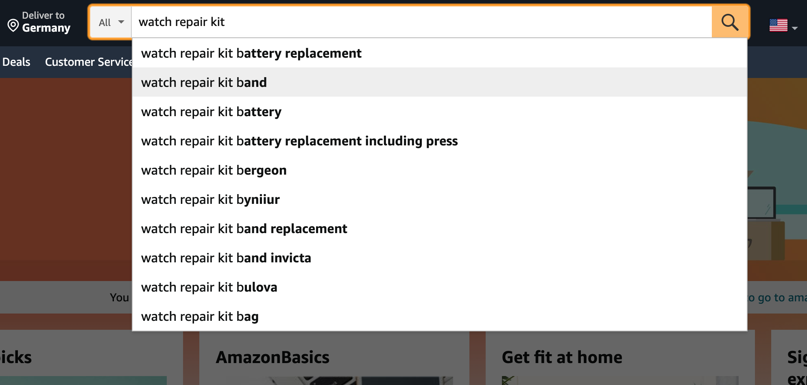

# keyword-search-volume

## Requirement
You have to implement a microservice with a single REST endpoint.
This endpoint should receive a single keyword as an input and should return a score for that
same exact keyword. The score should be in the range [0 → 100] and represent the
estimated search-volume (how often Amazon customers search for that exact keyword). A
score of 0 means that the keyword is practically never searched for, 100 means that this is
one of the hottest keywords in all the amazon.com right now.

**Example API Request** 

```
REQUEST GET http://localhost:8080/estimate?keyword=iphone+charger
RESPONSE
{
  “Keyword”:”iphone charger”,
  “score”:87
}
```

## How are you supposed to do that?
Amazon do not provide any information on the search-volume of keywords. It is a well-kept
company secret. Also, cross-references to search-volumes from other search-engines like
google are not accurate, since the search behavior for product discovery is fundamentally
different from general search. The only hint we get from Amazon about which keywords are
an important comes from their AJAX autocomplete API. You can reverse-engineer how it works
by typing text into the search-box on the amazon.com.

**Amazon Autocomplete API**
`https://completion.amazon.com/search/complete`

Your job is to extract a possibly precise estimation from the data you get from the
autocomplete API by understanding the logic that Amazon applies when choosing the
suggested keywords, reverse engineering it and finding a clever algorithm that utilizes the
information to compute the search-volume score.
```
There is no hack or leak in the API. You will have to figure out a way to
work with the data that you get.
```
The microservice can not use any database or cache, all results have to be computed live.
**Your microservice has an SLA of 10 seconds for a request round-trip.** You can perform
as many calls to the autocomplete API as you want during those 10 seconds.

## What you can assume about the Amazon API
Read this section carefully. The key to a good solution is in here. You might see some
deviation from this description in the calls that you make, but for the scope of this
assignment we will assume the following:
- For any search input, Amazon will only return up to 10 keywords, that have an exact
prefix-match with the input.
- Any keyword with a relevant search-volume can be returned by the API.
- Whenever the API is called, it operates in 2 steps:
    - Seek: Get all known keywords that match the prefix and create a
   Candidate-Set
    - Sort/Return: Sort the Candidate-Set by search-volume and return the top 10 results
- **hint:** the order of the 10 returned keywords is comparatively insignificant!

### What assumptions did you make?
I assume that Amazon's suggestion list is based on the title, product specification details, and product specification bullet list, etc.
Amazon also considers that when customers search for the product they want, they start searching for the words that are most important to them,
which is why they type the words that are most significant to them first. Amazon sorts the suggested list according to the words entered by the customer.

### How does your algorithm work?
The algorithm scores the keywords and suggestions base on the order of each, then calculate the search search-volume base on them.

#### Score of keywords formulation: 
```
    MAX_SCORE = 100;
    STEP_VALUE = MAX_SCORE / keywords.length;
    score = (MAX_SCORE - (STEP_VALUE * indexOfKeyword));
```
EX: ``watch repair kit band`` as a keyword to search, the score for each is ``[100, 75, 50, 25]`` respectively.

#### Score of suggestion formulation:
```
    MAX_SCORE = 100;
    STEP_VALUE = MAX_SCORE / lengthOfSuggestionList;
    score = (MAX_SCORE - (STEP_VALUE * keywordPositionInSuggestions));
```
EX: Imagine the customer is looking for a ``watch repair kit ban`` but when s/he  types the ``watch repair ki`` what s/he is looking for appears
in the suggestion list so base on our Suggestion Formulation the score would be ``90 = 100 - (10 * 1)``


> As I mentioned above as soon as the result appears in the suggestion list the algorithm discontinues
> to search and then calculates the search-volume base on the keyword and suggestions list score.

#### The consequent of two formulation is:

```
    search volume = (keyword score * suggestion score) / 100
    45 = (50 * 90) / 100
```

### Do you think the (*hint) that we gave you earlier is correct and if so - why?
The hint is not correct since above it says that 
"Sort/Return: Sort the Candidate-Set by search-volume and return the **top 10** results"
, hence the order is important to Amazon Autocomplete API.

### How precise do you think your outcome is and why?
It is hard to estimate the precision of the algorithm since the Amazon suggestion is base on multiple factors such as title, hidden keyword, product detail etc. The algorithm I have developed is just base on the order of keywords and suggestions.

### Prerequisites
- Java 8
- Maven 3

### How to run
- To run it use this command: ``sudo docker build -t amazon-search-volume .``
- Then we run the docker image: ``sudo docker run -p 8090:8090 amazon-search-volume``
- The address of rest api is: ``http://loclahost:8090``
- The address of swagger is: ``http://loclahost:8090/swagger-ui.html#/``
  
### Or
- run to build app: ``mvn clean then mvn package``
- run ``java -jar target/amazon-search-volume.jar``